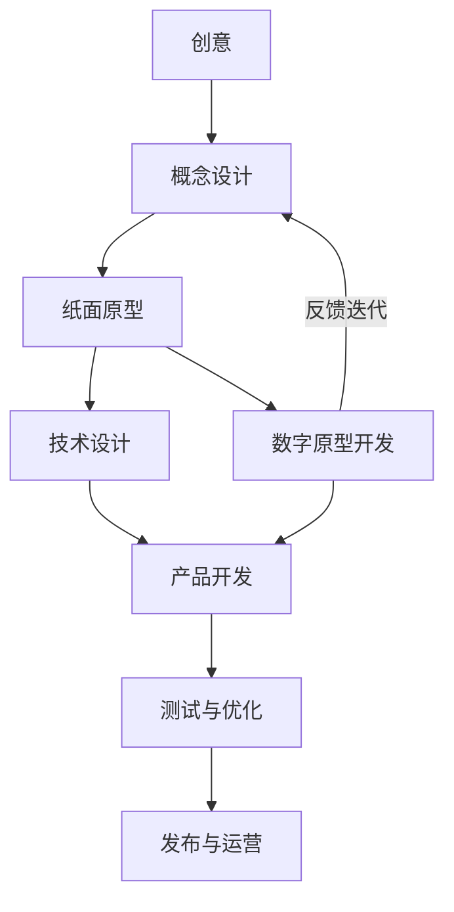

# 第一章：从玩家到开发者

## Core Idea
本章建立“做游戏 = 创造世界”的认知：理解游戏为何让人着迷、游戏由哪些要素构成，并掌握从创意到可玩产品的迭代式开发流程，为后续使用 Godot 亲手实践打基础。

## Frameworks Introduced
- **游戏四要素（目标/规则/反馈/自愿参与）**：好玩的游戏通常共享四个核心特征——目标提供成就感来源，规则通过限制提升挑战，即时反馈激励前进，自愿参与保证内在动机。
  - When to use: 设计或复盘任何玩法时，逐项检查是否四者齐备。
  - How: 缺少目标则玩家迷茫；缺少规则则没有挑战；缺少反馈则无法学习；缺少自愿则只剩负担。
- **心流（Flow）理论**：当任务目标清晰、挑战与玩家能力匹配、反馈即时，人进入忘我的专注状态。
  - When to use: 设计关卡与难度曲线、调整操作反馈节奏时。
  - How: 挑战应随能力同步提升，既不让玩家无聊也不让玩家挫败。
- **游戏开发三阶段流程**：构思与验证 → 构建与实现 → 发布与运营。
  - When to use: 规划任何游戏项目、判断当前处于哪个阶段、决定下一步投入方向。
  - How: 先用低成本的纸面/数字原型验证核心乐趣，再进入全量开发，发布后继续迭代。
- **纸面原型（Paper Prototype）**：用卡片、图纸、骰子等模拟玩法流程并邀请试玩，在写代码前暴露逻辑问题。
- **能力三角（技术实现 / 视觉审美 / 玩法设计）**：开发者不必三方面都达到专家水准，但必须理解三者的语言并能在系统设计时沟通权衡。

## Key Concepts
- **游戏资源（Game Assets）**：构成游戏的图像、音频、动画、字体、数据等素材，是体验设计的一部分。
- **资源恰当性**：好的资源不必华丽，但必须与玩法风格、交互反馈和情绪引导一致。
- **原型（Prototype）**：为快速验证核心玩法与技术可行性而制作的临时版本，不求画面精美。
- **迭代式开发**：概念设计 → 原型 → 试玩反馈 → 修改设计 → 再制作原型的持续循环。
- **Game Jam**：限时游戏开发马拉松，逼迫在资源受限下做高效决策。
- **教程陷阱**：只跟教程敲代码、看到画面动就以为自己学会的“勤奋幻觉”。

## Mental Models
- Think of 游戏引擎 as “厨房”、游戏设计 as “菜谱”、美术与音效素材 as “食材”：再好的厨房也离不开食材，但食材不会自动变成菜。
- Think of 制作游戏 as 在无序中构建秩序：规则要自洽、系统要可运行、体验要被他人理解。
- Use 从玩家到开发者的转换 when you want 掌控定义规则的主导权——思考“如果重力不存在会怎样”。
- Use 教学相长 when 检验自己是否真的学会：能向别人讲清楚一个技术难点，才算真正掌握。

## Anti-patterns
- **教程陷阱（跟随式复制）**：只复现不重构，大脑没有参与逻辑构建；学完应删掉代码、凭回忆独立重建。
- **只想不做 / 信息过载**：看视频产生“我学会了”的错觉，面对空白项目却无从下手；应以小项目动手作为唯一检验标准。
- **追求资源华丽而忽略匹配**：像素风游戏配高分辨率现代 UI、战斗节奏紧张却没有打击音效，都会破坏体验。
- **孤岛式闭门造车**：不与社区互动、不参加 Game Jam、不输出所学，成长速度远低于实战压力下的迭代。

## Code Examples
本章无代码，示范的开发流程图为 Mermaid 图：

- **What it demonstrates**: 原型与概念设计之间存在持续反馈迭代，而不是线性推进。

## Reference Tables
| 阶段 | 主要任务 | 关键产出 |
|---|---|---|
| 构思与验证 | 定义核心机制、制作纸面/数字原型、验证趣味性与技术可行性 | 可评估的雏形 |
| 构建与实现 | 程序逻辑、资源整合、关卡内容、测试优化 | 可玩版本 |
| 发布与运营 | 多平台导出、宣传、反馈收集、内容更新 | 上线产品并持续迭代 |

| 资源类型 | 示例 | 作用 |
|---|---|---|
| 图形 | 2D 立绘、3D 模型、纹理 | 视觉表现 |
| 音频 | BGM、交互音效 | 氛围与反馈 |
| 动画 | 序列帧、骨骼动画 | 角色行为表现 |
| 字体 | 标题/菜单字体 | 文本显示风格 |
| 数据 | JSON/CSV/XML 关卡与配置 | 游戏内容与参数 |

## Worked Example
作者建议的学习路径：先完全跟随教程完成一个小项目建立流程感知 → 然后引入“变量”（换美术、调物理参数、加小功能）锻炼逻辑掌控 → 再凭记忆复刻经典玩法跨越模仿阶段 → 最后从零构建一个哪怕简陋的原创作品，完成从消费者到创造者的转变。判断标准不是“运行成功”，而是离开教程后能否独立重建。

## Key Takeaways
1. 设计玩法时先检查目标、规则、反馈、自愿参与四要素是否齐全。
2. 在写大量代码前用纸面原型验证核心乐趣，成本最低、信息最多。
3. 资源必须与玩法匹配——“恰当”比“华丽”重要。
4. 跟教程跑通后删掉代码重写一遍，否则只是“昂贵的复印机”。
5. 开发是迭代循环：概念设计、原型、试玩反馈反复进行，不是一次成型。
6. 通过 Game Jam、社区输出和写开发日志加速成长。

## Connects To
- **Ch 2**: 本章建立开发流程认知，下一章补齐 2D 游戏开发的技术基础（游戏循环、对象、碰撞、图形与数学）。
- **Ch 3**: “用 Godot 做原型验证”将在引擎入门章节落地。
