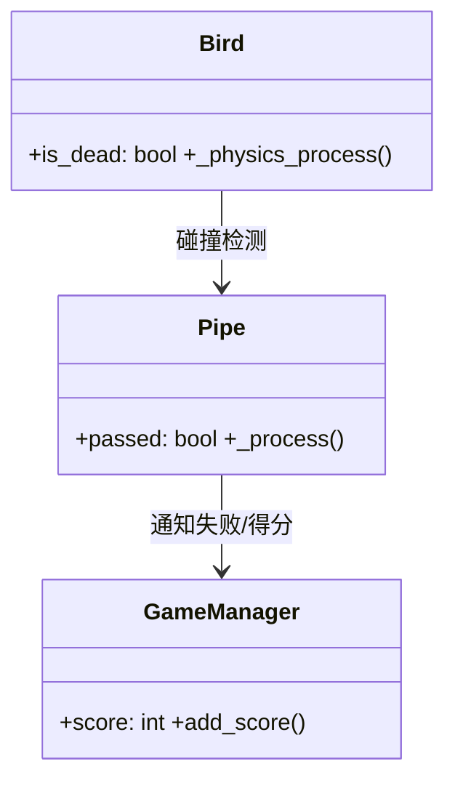
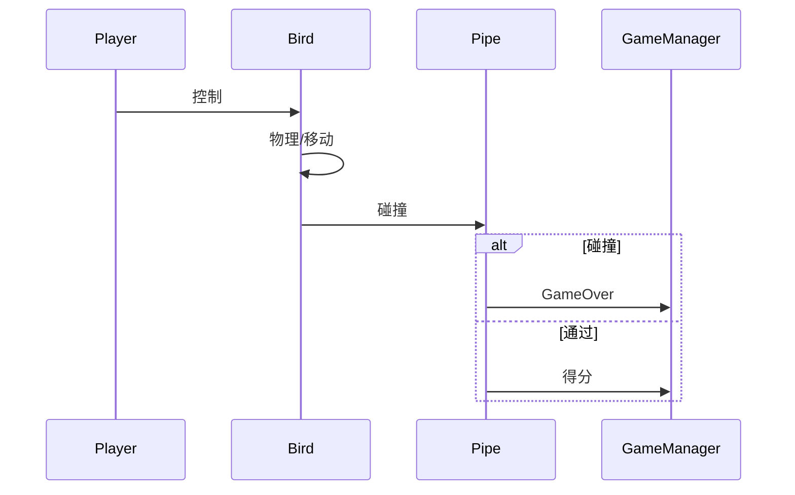

# 第十六章：面向对象设计与编程风格指南

## Core Idea
本章收束全书的工程能力：用 OOAD（分析→设计→类图/顺序图）在写码前理清“谁负责什么”；把 OOP 四特性与 Godot 节点体系对应；用“组合优于继承”、SOLID 与四种常用设计模式管理复杂度；最后给出 GDScript 风格规范与目录组织建议，让项目可维护、可扩展、可协作。

## Frameworks Introduced
- **OOAD 两阶段**：OOA（从需求识别对象与职责，构建概念模型）→ OOD（定义类属性/方法/交互，画类图与顺序图）。
  - Why: 防止“边想边写”的维护地狱；先看清结构再写代码。
- **OOAD 落地 Godot 的映射**：对象=节点/场景（含属性、方法、信号）；职责=每个节点的脚本；交互=函数调用（强关联/父子）+ 信号（跨场景解耦）。
  - Workflow: 分析建模 → 绘制设计图 → 构建场景树 → 编写脚本 → 设定交互 → 逐步测试协作。
- **设计驱动 vs 原型驱动**：玩法明确/规模大/多人协作→先设计后编码；玩法未验证/实验期→快速原型。
  - Anti: 过早优化是万恶之源——原型阶段别加复杂抽象层与通用接口。
  - Bridge: 原型稳定后靠重构（不改变外部行为改善结构），形成 设计→原型→反馈→重构→稳定 的健康循环。
- **OOP 四特性**：抽象（提取本质、统一接口）、封装（数据+行为绑在一起、对外隐藏细节）、继承（is-a 复用）、多态（同一接口不同实现）。
- **组合优于继承（has-a）**：功能做成组件按需挂载；避免单继承僵化、类爆炸。
  - Example: Battle Tank 敌方坦克组合 Detect/Weapon/Navigation/Health 等组件。
- **SOLID 五原则**：
  - SRP 单一职责：一个类只做一件事（Hurt/Health/Weapon 各自独立）。
  - OCP 开放封闭：扩展开放、修改封闭（承伤组件不改，挂不同 CollisionShape 扩展）。
  - LSP 里氏替换：子类可替换父类（任何 State 子类都能被 StateMachine 驱动）。
  - ISP 接口隔离：别强迫炮塔实现 move()；拆组件按需组合。
  - DIP 依赖反转：依赖抽象/接口而非具体（EnemyManager 用 @export PackedScene 代替硬编码路径）。
- **四种设计模式**：
  - Singleton 单例：Godot Autoload（GameManager/SoundManager/Input）。
  - Observer 观察者：信号 connect/emit 发布订阅。
  - Factory 工厂：集中创建逻辑（VFXManager 统一实例化特效）。
  - State 状态模式：状态封装为独立类由状态机切换（巡逻/搜索/攻击）。
- **GDScript 风格规范**：snake_case 变量/函数、PascalCase 类、SCREAMING_CASE 常量；函数 ≤30 行、动词开头、单行 ≤80；早期返回减嵌套；私有函数 _ 前缀；脚本顺序：class_name/extends→信号→常量→@export→成员/@onready→生命周期→核心逻辑→私有辅助。
- **目录结构**：按功能模块分（scenes/scripts/assets 各自归类，适合中大型/协作）vs 按对象聚合（player/ 下 gd+tscn+png+音效，适合原型/初学者）；可混合。

## Key Concepts
- **类图（Class Diagram）**：类名/属性/方法 + 依赖关系，回答“系统长什么样”。
- **顺序图（Sequence Diagram）**：对象按时间发消息，回答“系统如何运行”。
- **UML**：语言无关的软件结构/行为可视化语言。
- **抽象/封装/继承/多态**：Node2D→Sprite2D/CharacterBody2D 等继承链就是 Godot 的 is-a 结构。
- **is-a vs has-a**：继承 vs 组合的判断标准。
- **Autoload**：Godot 单例实现，全局唯一、任意访问。
- **信号（Signal）**：Godot 观察者；定义→connect→emit。
- **Refactoring**：外部行为不变、内部结构持续改善。
- **@export PackedScene**：依赖注入实现 DIP 的编辑器做法。
- **State Pattern + FSM**：模式封装行为类，FSM 管切换流程，两者结合。
- **类型提示与空值检查**：`var speed: float`、`is_instance_valid()` / `!= null`。
- **BBCode/类型注释**：次要，风格服务于可读性。

## Mental Models
- Think of OOAD as 写作文前先列提纲：对象=角色、职责=段落主题、交互=起承转合。
- Think of 组合 as 乐高：需要什么能力就拼什么积木；继承 as 家族血统：一旦血脉固定很难改。
- Think of SRP as 别让厨师同时洗碗：一个人一个岗位，互不拖累。
- Think of OCP as 游戏主机插卡带：换新游戏不用拆开焊电路。
- Think of LSP as Type-C 接口：任何宣称支持 Type-C 的充电宝必须能插能用。
- Think of ISP as 健身房按项目收费：别让只跑步的人为泳池买单。
- Think of DIP as 连 WiFi：你只依赖 WiFi 协议，不关心底层路由器品牌。
- Think of 设计模式 as 菜谱：不是模板代码，是“这个场景这么解决比较稳”的经验。
- Think of 代码风格 as 公共场合礼仪：别人读你的代码像读你的字迹，整洁才愿协作。

## Anti-patterns
- **没做 OOA/OOD 直接写码**：职责混乱、交互纠缠；先列对象与责任表。
- **把所有逻辑堆进 Player.gd**：输入/得分/失败全在一个脚本，改一个功能牵全身。
- **过早优化/过度抽象**：原型阶段引入复杂接口层，减慢创意迭代。
- **只依赖继承扩展功能**：单一父类限制灵活；优先组合。
- **违反 ISP 的“大而全基类”**：炮塔被迫实现 move()；拆组件。
- **硬编码依赖（具体路径/具体类）**：违反 DIP；用 @export 注入 PackedScene/节点。
- **状态逻辑塞满 if/else**：用状态模式拆分。
- **不遵守命名/长度规范**：代码难读难协作；官方风格是团队默认语言。
- **过度设计模式**：简单问题别硬套模式；模式是解决方案不是目标。

## Code Examples
OOAD 产物落地：Flappy Bird 类图/顺序图（Mermaid）：


- **What it demonstrates**: 编码前用 UML 定结构与流程。

组件式 FSM 接口（LSP/State Pattern）：
```gdscript
# State.gd
extends Node
class_name State
func physics_update(_delta: float) -> void: pass
```
```gdscript
# 任意具体状态只需实现同一接口
extends State
func physics_update(_delta: float) -> void:
    # 巡逻/攻击/搜索各自行为
    pass
```
- **What it demonstrates**: 基类接口 + 子类替换 = LSP；状态模式封装行为。

依赖反转（DIP）：
```gdscript
# EnemyManager
@export var enemy_tank_scene: PackedScene   # 不在代码里硬编码 res:// 路径
@export var enemy_mis_scene: PackedScene
```
- **What it demonstrates**: 高层依赖“抽象场景类型”，具体换谁由 Inspector 注入。

GDScript 风格骨架：
```gdscript
class_name HealthComponent
extends Node

signal health_changed(percent: float)
signal died

const MAX_HEALTH := 100

@export var start_health: float = 100
@onready var current_health := start_health

func _ready() -> void:
    current_health = start_health

func take_damage(value: float) -> void:
    current_health = max(current_health - value, 0.0)
    health_changed.emit(current_health / MAX_HEALTH)
    if current_health <= 0:
        died.emit()
```
- **What it demonstrates**: 声明顺序、类型提示、命名与空行规范的样板。

## Reference Tables
| SOLID | 原则 | 项目示例 |
|---|---|---|
| S | 单一职责 | 组件各管一事 |
| O | 开放封闭 | 扩展 CollisionShape 不改承伤组件 |
| L | 里氏替换 | 任意 State 子类可被状态机驱动 |
| I | 接口隔离 | 炮塔不实现 move() |
| D | 依赖反转 | @export PackedScene 注入 |

| 模式 | Godot 载体 | 用例 |
|---|---|---|
| 单例 | Autoload | GameManager/SoundManager |
| 观察者 | 信号 | 跨模块通知 |
| 工厂 | 统一生成器 | VFXManager 特效 |
| 状态 | 状态节点类 | 坦克 Patrol/Attack/Wander |

| 目录方案 | 适合 | 优点 | 缺点 |
|---|---|---|---|
| 按功能模块 | 中大型/协作 | 类型集中易重用 | 对象文件分散 |
| 按对象聚合 | 原型/初学 | 一个对象一目了然 | 资源易冗余 |

| 命名 | 风格 | 示例 |
|---|---|---|
| 变量/函数 | snake_case | player_speed / move_and_jump |
| 类名 | PascalCase | GameManager |
| 常量 | SCREAMING_SNAKE | MAX_HEALTH |
| 信号 | snake_case | hit_detected |
| 私有函数 | _ 前缀 | _reset_timer |

## Worked Example
从混乱到规范的演化：第五章先“功能堆叠”做出 Flappy Bird（能跑）；第七章用 OOAD 复盘——OOA 列出 Bird/Pipe/GameManager 与责任表，OOD 画类图与顺序图；落成 Godot 时 Bird 场景只管玩家物理、Pipe 管移动与判定、GameManager 管得分/状态，交互全走信号。项目后期把 Enemy 拆成组件（SRP+组合）、State 子类（LSP+状态模式）、VFXManager 工厂、GameManager/SoundManager 单例、@export 注入场景（DIP），最后按官方风格命名并组织目录，形成可维护作品。

## Key Takeaways
1. OOAD = 先分析对象与责任，再设计结构与交互，最后才写码。
2. 类图管结构、顺序图管流程，是编码前的低成本试错。
3. OOP 四特性在 Godot = 节点继承链 + 场景组合 + 信号多态。
4. 组合优于继承：需求多变就用组件拼。
5. SOLID 让系统对扩展开放、对修改封闭，是架构的护栏。
6. 单例/观察者/工厂/状态四模式覆盖 Godot 绝大多数架构场景。
7. 风格与目录是团队的通用语言：先统一，再优化。

## Connects To
- **Ch 1-4**: OOP 从第二章概念、第四章 GDScript 一路铺垫至此收束。
- **Ch 5-7**: 用 Flappy Bird/Battle Tank 做 OOAD 复盘与重构案例。
- **Ch 9**: 状态模式 = 第九章状态机的面向对象实现。
- **Ch 11/12**: EnemyManager/DIP、地图生成类封装都是本章原则的实例。
